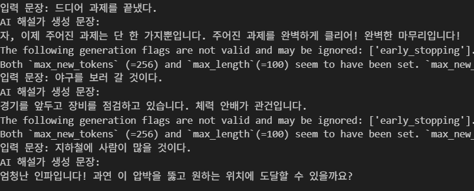

# AI 스포츠 해설가 봇

일상적인 문장을 입력하면 스포츠 경기처럼 박진감 넘치고 재미있는 해설로 바꿔주는 AI 챗봇입니다. SKT의 KoGPT2 모델을 커스텀 데이터셋으로 파인튜닝하여 만들었습니다.

## 🚀 주요 기능

- **스타일 변환**: 평범한 문장을 특정 스타일(스포츠 해설)의 문장으로 변환합니다.
- **KoGPT2 파인튜닝**: `transformers` 라이브러리의 `Trainer`를 사용하여 SKT의 KoGPT2 모델을 손쉽게 파인튜닝합니다.
- **커스텀 데이터셋 활용**: `입력-출력` 쌍으로 구성된 간단한 텍스트 파일로 자신만의 AI를 학습시킬 수 있습니다.

---

## 📝 데모



---

## 📂 프로젝트 구조

```
.
├── commentary_bot.ipynb       # 메인 파인튜닝 및 테스트 노트북
├── data/
│   └── commentary_dataset.txt # 학습용 데이터셋
└── fine-tuned-kogpt2-commentary/ # 파인튜닝된 모델과 토크나이저가 저장되는 폴더
```

---

## 🛠️ 설치 및 환경 설정

이 프로젝트를 실행하기 위해 아래 라이브러리들이 필요합니다.

```bash
pip install transformers[torch] datasets accelerate
```

- **GPU 환경 권장**: 파인튜닝 과정은 GPU가 있는 환경(예: Google Colab의 T4 GPU)에서 실행하는 것을 권장합니다.

---

## 📖 사용 방법

`commentary_bot.ipynb` 노트북의 셀을 위에서부터 순서대로 실행하면 됩니다.

### 1. 데이터 준비

`data/commentary_dataset.txt` 파일에 아래와 같은 형식으로 학습시킬 데이터를 준비합니다.

```
입력: [일상 문장 1]
출력: [해설 스타일 문장 1]
---
입력: [일상 문장 2]
출력: [해설 스타일 문장 2]
---
```

### 2. 모델 파인튜닝

노트북의 전처리 및 학습 관련 셀을 실행하여 `skt/KoGPT2-base-v2` 모델의 파인튜닝을 진행합니다. 학습이 완료되면 결과물은 `./results/` 폴더에, 최종 모델은 `./fine-tuned-kogpt2-commentary/` 폴더에 저장됩니다.

### 3. AI 해설가 테스트

학습이 완료된 후, 노트북의 마지막 테스트 셀을 실행하여 AI 해설가의 성능을 테스트할 수 있습니다. `input()` 창에 테스트할 문장을 입력하고 결과를 확인하세요.

```python
# 노트북 마지막 셀 예시

while True:
    input_prompt = input("테스트할 문장을 입력하세요: (나가기=q)")
    if input_prompt == "q":
        break
    
    # ... (텍스트 생성 코드) ...
    
    print(commentary)
```

---

## 🤖 사용된 모델

- **Base Model**: [skt/KoGPT2-base-v2](https://huggingface.co/skt/KoGPT2-base-v2)
